# 复现过程和遇到的问题

# UMGF

## 依赖库

```bash
pillow                    7.1.2            py37hb39fc2d_0    anaconda
python                    3.7.16          h7a1cb2a_0.conda
pytorch                   1.7.1           py3.7_cuda11.0.221_cudnn8.0.5_0    pytorch
pytorch-crf               0.7.2                     <pip>
torchaudio                0.7.2                      py37    pytorch
torchvision               0.8.2                py37_cu110    pytorch
tqdm                      4.62.3             pyhd8ed1ab_0    conda-forge
transformers              3.4.0                     <pip>

```

## 运行：

```bash
nohup python -u ddp_mmner.py --do_train --txtdir=./my_data/twitter2015 --imgdir=./data/twitter2015/image --ckpt_path=./model.pt --num_train_epoch=30 --train_batch_size=4 --lr=0.0001 --seed=2019  > output.txt &
```

## bug

#### 显存爆了(只有12g)

batchsize改成4（原来的1/4）

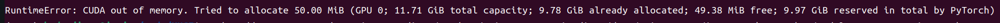

#### 测试论文的model.pt出错

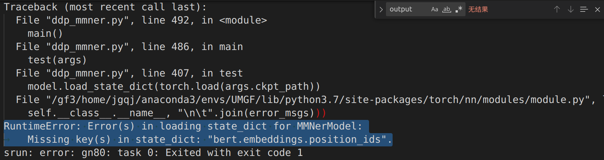

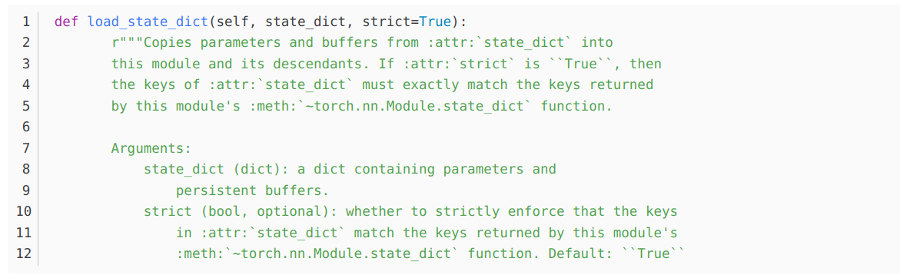

上面是load\_state\_dict方法参数的官方说明 strict  参数默认是true，他的含义是 **是否严格要求state\_dict中的键与该模块的键返回的键匹配**，这里改成false

#### 不存在文件夹

手动mkdir

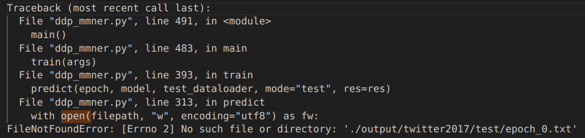

#### 模型需要手动下载(有网略过此条)

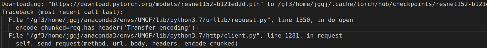

# UMT

#### UMT手动下载词典

修改词典路径

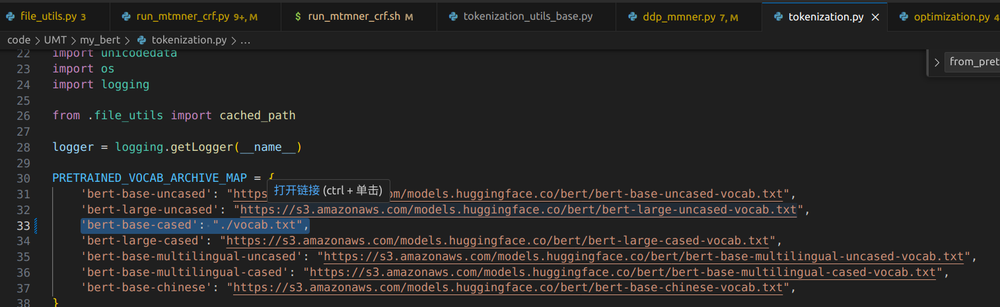

#### 需要卸载

出现下述bug

```bash
run_mtmner_crf.py
twitter2015
MTCCMBert
Traceback (most recent call last):
  File "/gf3/home/jgqj/anaconda3/envs/UMT/lib/python3.7/site-packages/torch/__init__.py", line 172, in _load_global_deps
    ctypes.CDLL(lib_path, mode=ctypes.RTLD_GLOBAL)
  File "/gf3/home/jgqj/anaconda3/envs/UMT/lib/python3.7/ctypes/__init__.py", line 364, in __init__
    self._handle = _dlopen(self._name, mode)
OSError: /gf3/home/jgqj/anaconda3/envs/UMT/lib/python3.7/site-packages/torch/lib/../../nvidia/cublas/lib/libcublas.so.11: symbol cublasLtHSHMatmulAlgoInit version libcublasLt.so.11 not defined in file libcublasLt.so.11 with link time reference

During handling of the above exception, another exception occurred:

Traceback (most recent call last):
  File "run_mtmner_crf.py", line 12, in <module>
    import torch
  File "/gf3/home/jgqj/anaconda3/envs/UMT/lib/python3.7/site-packages/torch/__init__.py", line 217, in <module>
    _load_global_deps()
  File "/gf3/home/jgqj/anaconda3/envs/UMT/lib/python3.7/site-packages/torch/__init__.py", line 178, in _load_global_deps
    _preload_cuda_deps()
  File "/gf3/home/jgqj/anaconda3/envs/UMT/lib/python3.7/site-packages/torch/__init__.py", line 158, in _preload_cuda_deps
    ctypes.CDLL(cublas_path)
  File "/gf3/home/jgqj/anaconda3/envs/UMT/lib/python3.7/ctypes/__init__.py", line 364, in __init__
    self._handle = _dlopen(self._name, mode)
OSError: /gf3/home/jgqj/anaconda3/envs/UMT/lib/python3.7/site-packages/nvidia/cublas/lib/libcublas.so.11: symbol cublasLtHSHMatmulAlgoInit version libcublasLt.so.11 not defined in file libcublasLt.so.11 with link time reference
srun: error: gn80: task 0: Exited with exit code 1
```

卸载了一个包

```bash
pip uninstall nvidia_cublas_cu11
```

#### 训练报错

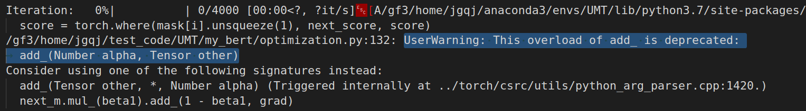

什么东西过期了

修改之前：

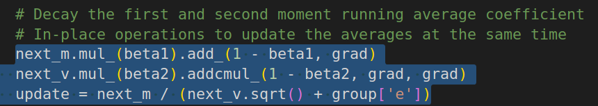

修改之后：

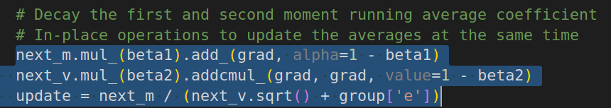

## 实验复现

现在在相同数据集，不同数据集上都跑了训练（总共4个）

在twitter2017上训练，在2015上测试；在twitter2015上训练，在2017上测试；

在twitter2017上训练，在2017上测试；在twitter2015上训练，在2015上测试；

修改了测试集（之前测试和训练都是在同一个数据集不同部分）

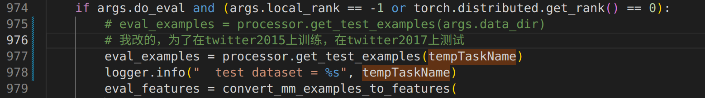

```bash
nohup srun -w gn69 sh run_2015.sh | col -b >> UMT_OUT_2015.txt &
nohup srun -w gn70 sh run_2015_same.sh | col -b >> UMT_OUT_2015_same.txt &
nohup srun -w gn71 sh run_2017.sh | col -b >> UMT_OUT_2017.txt &
nohup srun -w gn72 sh run_2017_same.sh | col -b >> UMT_OUT_2017_same.txt &
```

## 训练时不用gpu

这里的`CUDA_VISIBLE_DEVICES=` 表示当前可以被python环境程序检测到的显卡，而不是显卡数

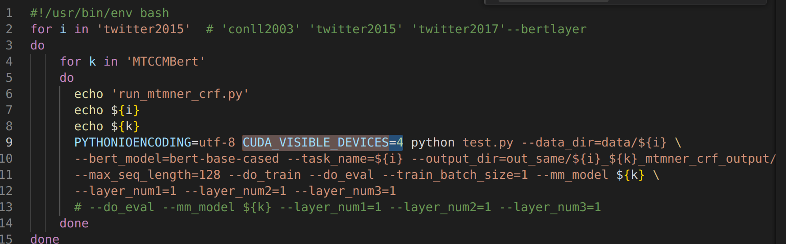

应为`CUDA_VISIBLE_DEVICES=`\[0,1,2,3]，或直接删掉这个选项即可
